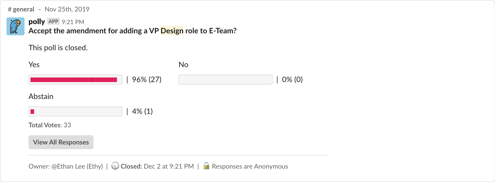

# Amendment 1

Drafted: Emily Zhong

Proposed: 2019.11.20

Proposed by: Executive Team

Ratified: 2019.11.25

## Voting

> Votes: 44 Total Membership, 27 Yes, 0 No, 1 Abstain



## Pretext

Given the design expansion, our teams are composed of more than just developers. Currently, the exec team contains positions to manage different "roles" in Blueprint, but there is no role in leadership that manages the new designer role. If we want designers to continue flourishing, learning, impacting, and being a part of Blueprint, there should be a design-oriented position in leadership.

## Text

[Decision Log Entry](https://www.notion.so/We-added-a-VP-of-Design-position-responsible-for-design-aspects-of-projects-and-designer-roles-c544d3208ff7424ab0844d19171fc58d)

### The Role

#### Responsibilities

1. The Vice President of Design is responsible for fostering design thinking and ensuring design processes within Blueprint's project teams.
2. The Vice President of Design is the principle advisor and resource of design for project groups. 
3. The Vice President of Design shall, with the advice and consent of the Executive Committee, determine the designer application process by the second week of the semester.

#### In more tangible actions

*tl;dr: Move current UX Design Director responsibilities → VP Design*

- Run design meetings
- Provide feedback and creating an environment where designers can get feedback from one another
- Continuously look into how the **designer** experience can be improved, both in the scope of designer satisfaction and team/project quality
- Continue to iterate on:
  - design recruitment, to see how we can best evaluate designers in a way that is fair, unbiased, and reflective of the work to be produced
  - design education
    - initial on boarding for designers, how do we ensure that they are continuously learning / are equipped and ready to handle their project?
    - for the rest of blueprint, how do we teach design thinking and the value of it in problem solving (beyond just making things look nice)

### Questions

#### Why not stay on External?

The work done by UX design director is inherently not external facing, but rather internal (towards success of projects and designer development). It doesn't make sense to continue having this position on a team dedicated to spreading Blueprint's mission to the rest of the campus.

#### Why not have both design directors merge into one, handling both sides?

Two ends of design spectrum — visual design vs product design

Considering external's growth and the work to be done refining and experimenting with this new role in Blueprint, it's infeasible to merge the two growing and now-larger roles back into one

## Changes

### IV. OFFICERS & ELECTIONS

#### 1. Executive Committee

```diff
- 1. The Executive Committee shall be composed of a President, Internal Vice President, External Vice President, Vice President of Projects and Vice President of Technology chosen at the end of the previous semester by election from the general membership.
- 2. Consent of the Executive Committee is when four-fifths of its members agree. The quorum for decision making is four.
+ 1. The Executive Committee shall be composed of a President, Internal Vice President, External Vice President, Vice President of Projects, Vice President of Technology, and Vice President of Design chosen at the end of the previous semester by election from the general membership.
+ 2. Consent of the Executive Committee is when two-thirds of its members agree. The quorum for decision making is five.
```

#### 7. Vice President of Design

```diff
+ 1. The Vice President of Design is responsible for fostering design thinking and ensuring design processes within Blueprint's project teams.
+ 2. The Vice President of Design is the principal advisor and resource of design for project groups. 
+ 3. The Vice President of Design shall, with the advice and consent of the Executive Committee, determine the designer application process by the second week of the semester.
```

### VI. CONSTITUTIONAL AMENDMENTS

```diff
- 1. The Executive Committee, whenever four-fifths of its members shall deem it necessary, shall propose Amendments to this Constitution...
+ 1. The Executive Committee, whenever two-thirds of its members shall deem it necessary, shall propose Amendments to this Constitution...
```

### VIII. SUPREMACY & OATHS

#### 3. Bylaws

```diff
- 3. A four-fifths majority of the Executive Committee is necessary to enact a bylaw.
- 4. A four-fifths majority of the Executive Committee is necessary to overturn a bylaw.
+ 3. A two-thirds majority of the Executive Committee is necessary to enact a bylaw.
+ 4. A two-thirds majority of the Executive Committee is necessary to overturn a bylaw.
```
